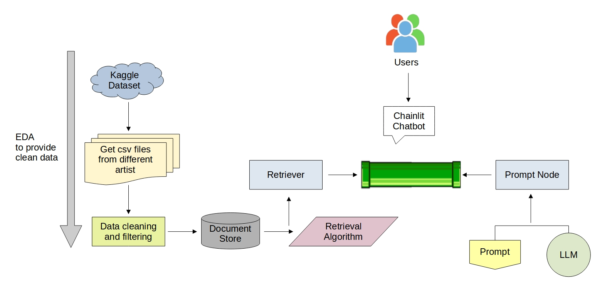
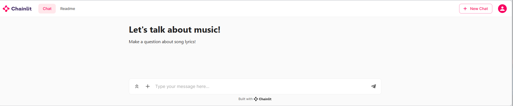
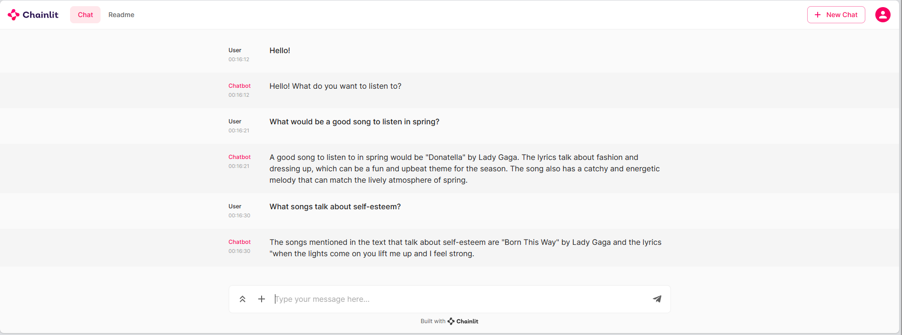

# Haob 2023

<p align="center">
 <h2 align="center">Haob 2023 Project</h2>
 <p align="center"><b>Haystack RAG pipeline for a chatbot.</b></p>
</p>

## ⚙️ Set up
Install poetry.
```
pip install poetry
```

Install required packages using the following command:
```
poetry install
```

## 📍 Haystack RAG pipeline for a chatbot

We're building a Haystack RAG pipeline for a chatbot that answers questions about music lyrics.

For this project, we're using a subset of this Kaggle Dataset: [Song Lyrics](https://www.kaggle.com/datasets/deepshah16/song-lyrics-dataset).

We're using Haystack for Document Store and build the RAG pipeline and Open AI GPT3.5-turbo LLM to build a chatbot with Chainlit for song lyrics.

## 🙌 Haystack Pipeline



1. **Setting up the Document Store**
   - Initializing an InMemoryDocumentStore with BM25 retrieval capabilities.

2. **Data Retrieval**
   - Downloading the lyrics dataset from Kaggle.
   - Loading lyrics data for different artists into dataframes.
   - Merging the dataframes into a single dataframe.
   - Data preprocessing, including column renaming and conversion to the document store format.

3. **Prompt Template**
   - Defining a `rag_prompt` template for generating responses from music lyrics and user questions.

4. **Retriever Configuration**
   - Configuring a BM25Retriever to work with the document store for document retrieval based on user queries.

5. **GPT-3.5 Turbo Configuration**
   - Setting up a `PromptNode` to utilize the GPT-3.5 Turbo model for generating responses. This includes specifying your OpenAI API key and using the `rag_prompt` template.

6. **Pipeline Setup**
   - Creating a pipeline (`pipe`) with two nodes: the retriever and the GPT-3.5 Turbo model.

7. **Main Function**
   - Defining the core functionality of the project, where user queries are processed using the pipeline, and responses are sent back to the user.


## 📩 User Interface

Welcome message from the chatbot.


We use Chainlit to make the chatbot.

